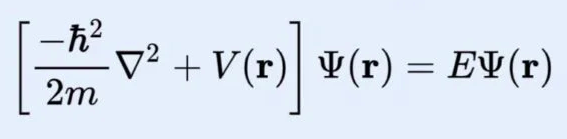
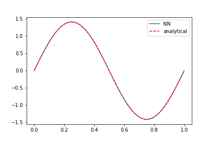
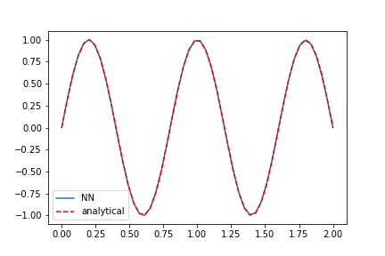

# Particle-in-a-Box

Solving Schrodinger's Equation with a Neural Network using numerical integration and automatic differentiation. The steps to run the python [notebook](kitchin.ipynb) is self-explanatory. All input variables are accepted as forms in the Google Colab notebook.

The neural network is successfully able to solve the Particle-in-a-Box potential for the first few eigen-energies and even upto the fifth eigen-energy.

> n=2

> n=5
